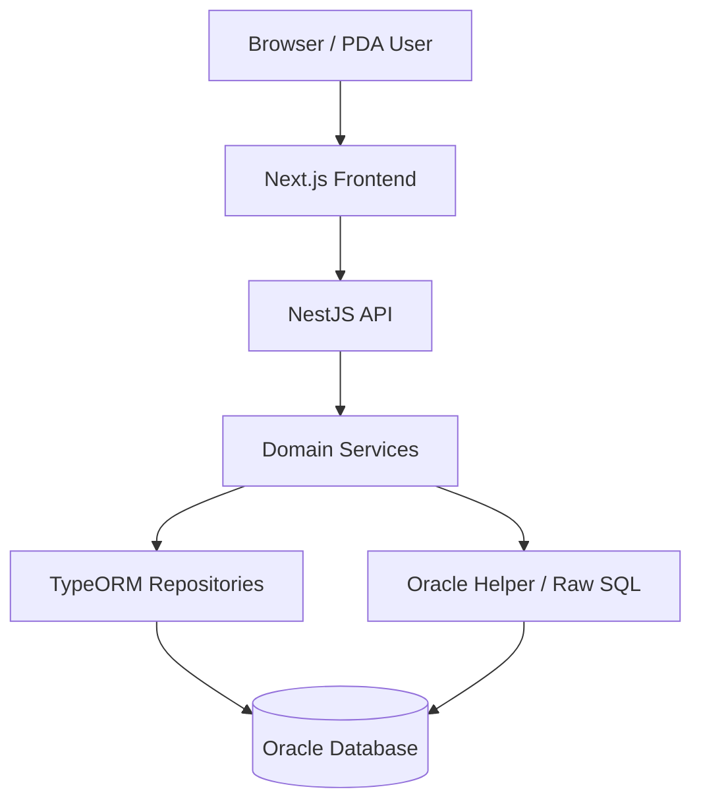

# HANES MES 프로젝트 업무 요약

## 1. 프로젝트 개요

- **명칭**: HANES MES (Harness Manufacturing Execution System)
- **목적**: 와이어 하네스(Wire Harness) 제조 공정의 전 과정을 디지털화하는 생산 실행 시스템
- **사용 환경**: 웹 브라우저(관리/사무) + PDA(현장 작업)
- **기준 사이트**: `JSHANES` (Oracle DB)

## 2. 시스템 구조



| 계층 | 기술 |
|------|------|
| 프런트엔드 | Next.js (App Router), Tailwind CSS, i18next |
| 백엔드 | NestJS, TypeORM, oracledb |
| 데이터베이스 | Oracle (운영), Supabase Postgres (보조) |
| 운영 | PM2, GitHub Actions, Turborepo (pnpm workspace) |

## 3. 업무 도메인 (4대 흐름)

### 3.1 자재 흐름 (Material)

```
구매발주 → 입하 → LOT 생성 → IQC 판정 → 입고 → 재고 반영 → 출고/투입
```

| 단계 | 핵심 엔티티 | 상태 |
|------|-----------|------|
| 입하 | `MatArrival` | `DONE` |
| LOT | `MatLot` | `iqcStatus = PENDING/PASS/FAIL/HOLD` |
| IQC | `IqcLog` | `PASS` / `FAIL` |
| 입고 | `MatReceiving` | PASS LOT만 가능 |
| 재고 | `MatStock`, `StockTransaction` | — |
| 출고 | `MatIssue` | `PROD/SCRAP/RETURN` |

**보조 흐름**: 자재 실사(physical-inv), 조정, 보류, 폐기

---

### 3.2 생산 흐름 (Production)

```
생산계획 → 계획 확정 → 작업지시 발행 → 작업 시작 → 자재/작업자/설비 투입
→ 생산실적 등록 → 실적 완료 → WIP/FG 재고 반영
```

| 단계 | 엔티티 | 상태 |
|------|--------|------|
| 생산계획 | `ProdPlan` | `DRAFT / CONFIRMED / CLOSED` |
| 작업지시 | `JobOrder` | `WAITING / RUNNING / HOLD / DONE / CANCELED` |
| 생산실적 | `ProdResult` | `RUNNING / DONE / CANCELED` |
| 완제품 라벨 | `FgLabel`, `ProductStock`, `ProductTransaction` | — |

**규칙**:
- `CONFIRMED` 계획만 작업지시 발행 가능
- `WAITING` 작업지시만 시작 가능
- 생산실적 완료 시 자동출고·설비/금형 갱신·제품재고 적재 동시 수행

---

### 3.3 품질 흐름 (Quality)

```
입고/생산 → 검사(IQC/공정검사/OQC) → 결과 등록 → 불합격 시 불량/재작업 → SPC/MSA 통계
```

| 하위 도메인 | 역할 |
|-----------|------|
| `inspection` | 공정 중 검사 (CONTINUITY/VISUAL/DIMENSION/FUNCTION) |
| `defects` | 불량 로그 및 처리 (`WAIT/REPAIR/SCRAP/PASS`) |
| `rework` | 재작업 |
| `oqc` | 출하 전 검사 (PASS여야 출하 가능) |
| `spc` / `msa` | 통계적 공정 관리 / 측정 시스템 분석 |
| `fai` / `ppap` | 초도품/양산 승인 |
| `continuity-inspect` | 도통 검사 |
| `audit` / `change-management` | 감사 / 변경 관리 |

---

### 3.4 출하 흐름 (Shipping)

```
고객주문 → 출하지시 확정 → 박스 포장 → 팔레트 적재 → 출하 생성
→ PREPARING → LOADED → SHIPPED → DELIVERED
```

| 단계 | 엔티티 | 상태 |
|------|--------|------|
| 고객주문 | `CustomerOrder` | `RECEIVED / CONFIRMED / SHIPPED / CANCELLED` |
| 출하지시 | `ShipmentOrder` | `DRAFT / READY / SHIPPED / CANCELLED` |
| 박스 | `BoxMaster` | `OPEN / CLOSED / SHIPPED` |
| 팔레트 | `PalletMaster` | `OPEN / CLOSED / LOADED / SHIPPED` |
| 출하 | `ShipmentLog` | `PREPARING / LOADED / SHIPPED / DELIVERED / CANCELED` |

**규칙**:
- OQC가 `FAIL` 또는 `PENDING`이면 출하 차단
- `PREPARING` 상태에서만 박스·팔레트 조정 가능
- 취소 시 FG 라벨·제품 트랜잭션도 함께 복원

## 4. 추적성 (Traceability)

**입력 키**: FG 바코드 · 생산 UID · 작업지시 번호 · LOT / 시리얼

**연결 경로**:
| 영역 | 추적 경로 |
|------|---------|
| 자재 | `PurchaseOrder → Arrival → IQC → Receiving → MatLot → MatStock` |
| 생산 | `ProdPlan → JobOrder → ProdResult` |
| 품질 | `ProdResult → InspectResult → DefectLog / TraceLog` |
| 출하 | `ShipmentOrder → Box → Pallet → Shipment` |

**조회 축 (4M)**: Man(작업자) / Machine(설비) / Material(자재 투입) / Method(검사·기준)

## 5. 부가 도메인

| 도메인 | 핵심 책임 |
|--------|---------|
| `equipment` | 설비 마스터, 점검, PM(예방보전), 금형, 설비 BOM |
| `outsourcing` | 외주 발주·납품·입고 |
| `customs` | 보세 / 통관 / 수불 이력 |
| `consumables` | 일반 소모품 수불·재고 |
| `interface` | ERP 등 외부 시스템 연동 |
| `scheduler` | 배치 설정·실행·로그·알림 |
| `system` | 공통코드, 시스템 설정, 사용자, 권한(RBAC) |
| `dashboard` | 대시보드 / 요약 통계 |
| `workflow` | 워크플로우 요약 |

## 6. 화면 그룹 (Frontend)

### 웹 (`apps/frontend/src/app/(authenticated)`)
`dashboard`, `master`, `material`, `inventory`, `production`, `quality`, `inspection`, `shipping`, `sales`, `equipment`, `customs`, `outsourcing`, `consumables`, `system`, `workflow`, `interface`, `product`

### PDA (`apps/frontend/src/app/pda`)
`login`, `menu`, `material/*`, `product/*`, `shipping/*`, `equip-inspect`, `settings`

## 7. 핵심 비즈니스 규칙 요약

1. **역처리 금지**: 입하 → IQC → 입고 → 출고 순서를 거꾸로 되돌릴 수 없음 (`implementation-rules.md`)
2. **PASS만 진행**: IQC PASS LOT만 입고, OQC PASS만 출하 가능
3. **상태 전이 검증**: 모든 상태 전이는 서비스 레이어에서 검증 후 수행
4. **추적성 우선순위**: `TraceLog` 우선, 없으면 `ProdResult + InspectResult`로 fallback
5. **멀티 테넌트**: `company` / `plant` 필드로 회사·공장 단위 데이터 격리 (`x-company`, `x-plant` 헤더)
6. **소프트 삭제**: `deletedAt`이 NULL이면 미삭제 (모든 엔티티 공통)

## 8. 원본 참고 문서

| 영역 | 문서 |
|------|------|
| 전체 인덱스 | [docs/readme.md](./readme.md) |
| 시스템 구조 | [design/01-system-architecture.md](./design/01-system-architecture.md) |
| 데이터 모델 | [design/02-data-model-erd.md](./design/02-data-model-erd.md) |
| 라우팅/API | [design/03-frontend-routing.md](./design/03-frontend-routing.md), [design/04-backend-api-endpoints.md](./design/04-backend-api-endpoints.md) |
| 백엔드 모듈 | [design/backend-module-index.md](./design/backend-module-index.md) |
| 업무 흐름 (상세) | [workflows/domain-workflows.md](./workflows/domain-workflows.md) |
| 업무 흐름 (인덱스) | [workflows/05-production-process-flow.md](./workflows/05-production-process-flow.md) |
| 용어집 | [standards/glossary.md](./standards/glossary.md) |
| 개발 규칙 | [standards/implementation-rules.md](./standards/implementation-rules.md) |
| 환경 설정 | [setup/environment-setup-guide.md](./setup/environment-setup-guide.md) |

---

> **작성 기준**: `docs/` 폴더의 design / workflows / standards / setup 카테고리 원본 문서들을 기반으로 코드 동작 사실에 한정하여 요약함. 상세 상태 규칙·예외 처리는 원본 문서와 서비스 코드를 우선한다.
