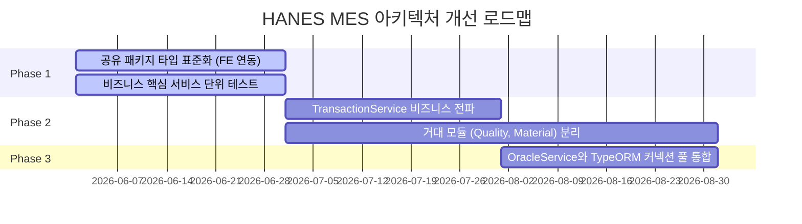

# HANES MES 모노레포 아키텍처 분석 보고서

**최종 분석일**: 2026-05-23  
**대상 프로젝트**: HANES MES (NestJS + Next.js + Turborepo + Oracle DB)  
**분석 범위**: 모노레포 전체 (`apps/backend`, `apps/frontend`, `packages/shared`)

---

## 1. 아키텍처 개요

본 프로젝트는 **Turborepo** 기반의 모노레포(Monorepo) 구조로 구성되어 있으며, 백엔드 API 서버와 프론트엔드(일반 MES 및 PDA 웹), 공통 타입을 정의하는 공유 패키지가 단일 저장소 내에 공존하는 아키텍처를 취하고 있습니다.

```mermaid
graph TD
    subgraph Monorepo [HANES MES Monorepo]
        subgraph Apps [Applications]
            FE["apps/frontend (Next.js 15)"]
            BE["apps/backend (NestJS 11)"]
        end
        subgraph Packages [Shared Libraries]
            SH["packages/shared (Types, Constants, Utils)"]
        end
    end

    FE -->|API Calls (Axios/React Query)| BE
    FE -.->|Import Types/Constants| SH
    BE -.->|Import Types/Constants| SH
    BE -->|ORM (TypeORM)| DB[(Oracle DB)]
    BE -->|Direct SQL (OracleService)| DB
```

---

## 2. 주요 구성 요소별 아키텍처 분석

### A. 백엔드 (`apps/backend`)
*   **프레임워크**: NestJS v11 (TypeScript)
*   **데이터베이스 연동**: TypeORM + `@nestjs/typeorm`을 기반으로 Oracle Database에 연결합니다.
*   **핵심 개선 사항 (반영 완료)**:
    1.  **트랜잭션 추상화**: `TransactionService`가 `src/shared/transaction.service.ts`에 도입되어 `createQueryRunner` 보일러플레이트를 줄일 수 있는 인프라가 확보되었습니다.
    2.  **단위 테스트 인프라**: Jest 테스트 환경이 구축되고 `transaction.service.spec.ts`, `numbering.service.spec.ts` 등의 테스트 파일이 작성되었습니다.
    3.  **채번 서비스 통합**: 기존에 분산되어 있던 채번 로직이 `NumberingService` 파사드와 `SeqGeneratorService`, `NumRuleService`를 기반으로 통합되었습니다.
*   **남아있는 아키텍처 부채**:
    *   **과도한 책임의 거대 모듈**: `QualityModule`, `MaterialModule` 등이 여전히 30개 이상의 엔티티와 다수의 컨트롤러/서비스를 일괄 로드하여 단일 책임 원칙(SRP)을 위반하고 있습니다.
    *   **트랜잭션 유틸리티 전파 미흡**: `TransactionService`가 개발되었으나 정작 트랜잭션이 빈번하게 일어나는 복잡한 비즈니스 로직(예: `JobOrderService`, `InventoryService`)에서는 여전히 `createQueryRunner`를 수동으로 제어하는 구형 코드가 남아 있어 불일치가 발생하고 있습니다.
    *   **단위 테스트 커버리지 저하**: 인프라 서비스에 대해서만 테스트가 작성되었을 뿐, 실제 핵심 비즈니스 로직에 대한 테스트 코드(`.spec.ts`)는 여전히 누락된 상태입니다.

### B. 프론트엔드 (`apps/frontend`)
*   **프레임워크**: Next.js 15.2 (React 19, Turbopack 사용)
*   **스타일링**: Tailwind CSS v4 + PostCSS
*   **상태 관리**: 
    *   클라이언트 전역 상태: `zustand`를 활용해 가볍고 직관적인 뷰 상태(UI 상태, 로그인 정보 등) 관리.
    *   서버 데이터 동기화 및 캐싱: `@tanstack/react-query`를 활용해 API 통신 상태 및 비즈니스 데이터 동기화.
*   **도메인 분리**:
    *   **`apps/frontend/src/app/(authenticated)`**: 사무실 및 관리자가 사용하는 표준 웹 대시보드 및 MES 관리 화면.
    *   **`apps/frontend/src/app/pda`**: 생산 현장에서 사용하는 단말기 전용 화면(자재 입출고, 설비 점검 등).
    *   이 두 영역이 App Router의 라우트 그룹 기능을 통해 한 프로젝트 내부에서 깔끔하게 경계가 구분되어 레이아웃과 접근 권한 가드(Guard)를 개별 적용하고 있습니다.

### C. 공유 패키지 (`packages/shared`)
*   **역할**: 공통 Enum, 상수, Dto 규격, 유틸리티를 한 곳에 모아 프론트엔드와 백엔드 간 불일치를 줄이기 위해 설계되었습니다.
*   **남아있는 아키텍처 부채**:
    *   **중복 타입 선언 및 모노레포 활용 미흡**: `packages/shared`에 정의된 비즈니스 객체 타입(예: `JobOrder`, `MaterialLot`)이 존재함에도 불구하고, 프론트엔드(`apps/frontend/src/types/index.ts`)는 `@harness/shared`를 사용하지 않고 독자적으로 중복 정의해서 사용하고 있습니다. 
    *   이로 인해 API 데이터 스펙이나 비즈니스 정책이 변경될 경우 두 곳의 타입을 수동으로 맞춰야 하는 타입 안전성(Type Safety) 누수가 발생합니다.

---

## 3. 핵심 아키텍처 문제점 & 개선 제안

### [1] 과도한 책임의 거대 모듈 (백엔드)
*   **현황**: `QualityModule`, `MaterialModule` 등의 결합도 및 크기가 너무 큽니다.
*   **영향**: 빌드 시간 증가, 코드 탐색의 어려움, 사소한 코드 변경이 전체 모듈 로드와 의존관계에 미치는 악영향.
*   **개선 제안**: 기능별 서브모듈(예: `defects.module.ts`, `oqc.module.ts`, `spc.module.ts` 등)로 점진적 분할.

### [2] 중복 타입 선언 및 모노레포 결합도 약화 (프론트엔드)
*   **현황**: 프론트엔드에서 `@harness/shared`에 정의된 풍부한 도메인 타입을 가져와 쓰지 않고, 로컬 `types/index.ts` 파일에 `JobOrder` 등을 중복으로 타이핑하여 관리 중입니다.
*   **영향**: API의 사소한 응답 포맷 수정이 프론트엔드와 백엔드 간 타입 불일치를 가져와 런타임 에러를 발생시킬 위험이 있습니다.
*   **개선 제안**: 프론트엔드 개발팀이 API 스펙 통일을 위해 `import type { ... } from '@harness/shared'` 형태로 도메인 타입을 가져오도록 점진적인 임포트 마이그레이션이 필요합니다.

### [3] 트랜잭션 구현 패턴의 불일치 (백엔드)
*   **현황**: `TransactionService` 유틸리티가 구축되어 있지만, 기존의 거대 비즈니스 서비스(`JobOrderService` 등)는 여전히 `createQueryRunner` 10줄 이상의 보일러플레이트를 반복하여 사용하고 있습니다.
*   **영향**: 휴먼 에러로 인한 `queryRunner.release()` 누수 위험 및 코드 가독성 저하.
*   **개선 제안**: `JobOrderService` 및 `InventoryService` 등의 신규/수정 메서드에 `TransactionService.run(...)` 패턴을 강제하고, 기존 코드 리팩토링 진행.

### [4] 이중 데이터베이스 통신 레이어 (백엔드)
*   **현황**: `DatabaseModule`(TypeORM 커넥션 풀)과 별개로 Raw SQL(오라클 패키지/함수 호출 등)을 처리하기 위해 `OracleModule`/`oracle.service.ts`가 자체 커넥션 풀을 관리하고 있습니다.
*   **영향**: 동일 데이터베이스에 대해 두 개의 독립된 커넥션 풀을 맺어 데이터베이스 인스턴스의 가용 커넥션을 낭비하게 됩니다.
*   **개선 제안**: TypeORM의 `queryRunner.manager.query()`를 사용해 원시 SQL을 실행함으로써 데이터베이스 커넥션 풀을 단일화하고 커넥션 자원을 최적화할 것을 권장합니다.

---

## 4. 우선순위별 개선 로드맵



### Phase 1 (단기 / 즉시 실행 권장)
1.  **프론트엔드 `@harness/shared` 연동**: 프론트엔드의 중복 정의된 타입들을 `@harness/shared/types` 임포트로 교체.
2.  **핵심 도메인 단위 테스트 구축**: `JobOrderService`, `InventoryService` 의 상태 변경 비즈니스 규칙에 대한 Jest 테스트 코드 작성.

### Phase 2 (중기)
1.  **트랜잭션 패턴 표준화**: 백엔드 서비스의 `createQueryRunner` 수동 호출 부를 `TransactionService.run` 콜백 구조로 일괄 리팩토링.
2.  **도메인 경계 분리**: `QualityModule`과 `MaterialModule`을 소형 서브모듈 단위로 쪼개기.

### Phase 3 (장기)
1.  **커넥션 풀 단일화**: TypeORM의 Native Driver 쿼리 실행 기능을 활용해 별도로 구동되는 `OracleService`의 커넥션 풀을 제거하고 자원 효율성 강화.
